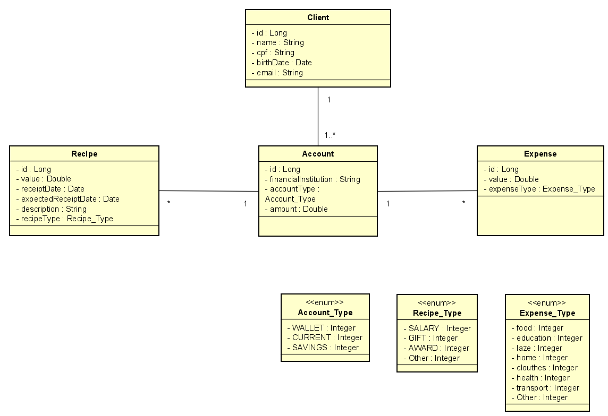

# <h1>Financial Control API</h1>

> Status: Developing⚠️

## 📋My objective with this project

Create a project with simple functions to put some ideas into practice.

### Doc: <a href="http://localhost:8080/swagger-ui/index.html#/">Click UP - Downloaded locally | Port: 8080</a>

## Need to download the sql file that is in "doc"

## 🤯Features implemented in the project

1. CRUD - Account, Client, Expense, Recipe
2. Search by date and type of recipe/expense in Recipe and Expense

### Client and Account

* Create client and account
* Edit client and account
* Remove client and account
* Search clients and account || search by id

### Recipes
* Register recipes
* Edit recipes 
* Remove recipes
* Search recipes
   * Filter by period (Start date – End date)
   * Filter by type of recipe
* list total recipes by account id

### Expenses 

* Register expenses
* Edit expenses
* Remove expenses
* Search expenses
    * Filter by period (Start date – End date)
    * Filter by type of expense
* list total expenses by account id

## 🚀Technologies Used:

<table>
  <tr>
    <td>Java 17</td>
    <td>Spring Boot</td>
    <td>Lombok</td>
    <td>MySQL</td>
    <td>Bean Validation</td>
</tr>
   <tr>
      <td>17</td>
      <td>3.0</td>
      <td>Null</td>
      <td>Null</td>
      <td>Null</td>
  </tr>
</table>

# UML

