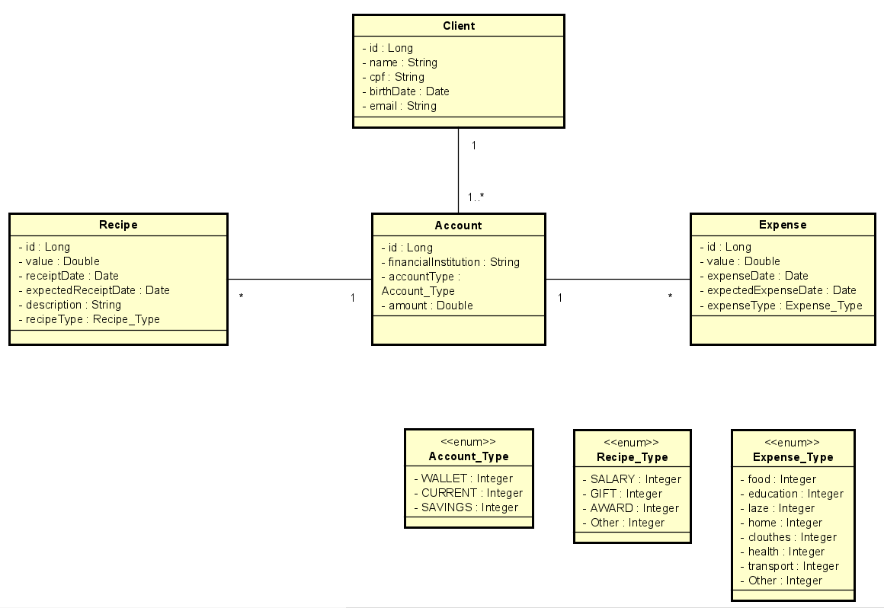

# <h1>Financial Control API</h1>

> Status: Developing⚠️

## 📋My objective with this project

Create a project with simple functions to put some ideas into practice.

### Doc: <a href="http://localhost:8080/swagger-ui/index.html#/">Click UP - Downloaded locally | Port: 8080</a>

## 🤯Features implemented in the project

1. CRUD - Account, Client, Expense, Recipe
2. Search by date and type of recipe/expense in Recipe and Expense

## 🚀Technologies Used:

<table>
  <tr>
    <td>Java 17</td>
    <td>Spring Boot</td>
    <td>Lombok</td>
    <td>MySQL</td>
    <td>Bean Validation</td>
</tr>
   <tr>
      <td>17</td>
      <td>3.0</td>
      <td>Null</td>
      <td>Null</td>
      <td>Null</td>
  </tr>
</table>

# UML

